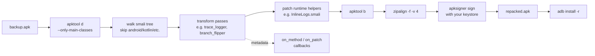

# ApkSmith

> Forge new behaviour into existing Android apps at the smali level.

ApkSmith is a toolchain for rewriting Android APKs: it decompiles an apk,
runs one or more **smali transform passes** (such as tracing every method
call, flipping a branch, or hooking an API), then repacks, re-signs, and
optionally reinstalls the result. It is designed as a platform — new
injection passes can be added without touching the decompile/repack
plumbing.

ApkSmith was extracted from the instrumentation core of
[SADroid](https://github.com/geniuspudding/SADroid) (a static-aided
dynamic analysis tool) so that the same rewriting engine can be reused
for arbitrary Android research / modding tasks.

## Status

**Pre-alpha.** Public API is intentionally small while it stabilises.
The initial code drop lands from SADroid via an in-place refactor; until
that merges, this repo contains the project skeleton only.

## Pipeline



## Use cases

- **Tracing**: log every method entry / exit, every branch taken, every
  target API call — dump to logcat and diff runs.
- **Evasion bypass**: flip anti-emulator / anti-debug branches so the
  real payload executes under a sandbox.
- **API hooking**: replace calls to a given `Lfoo/Bar;->baz()` with calls
  to your own stub method.
- **Constant patching**: rewrite a `const-string` or `const/16` in place.
- **Feature injection**: splice entirely new smali methods / classes
  into an existing app without access to its source.

## Prerequisites

ApkSmith is a Python orchestrator around standard Android reverse
engineering tools. You need:

| Tool | Purpose | How to get it |
|---|---|---|
| Python ≥ 3.11 | Orchestrator | python.org / pyenv |
| Java ≥ 11 | apktool / apksigner runtime | Temurin / Zulu |
| `apktool` | decompile / repack | https://apktool.org |
| `zipalign` | alignment | Android SDK build-tools |
| `apksigner` | v1/v2/v3 signing | Android SDK build-tools |
| `keytool` | generating a dev keystore (one time) | JDK |

All four binaries must be on `PATH`, or you can pass explicit paths via
`InstrumentConfig`.

## Quickstart

```bash
pip install -e .

# one-time: generate a dev keystore
./scripts/gen_dev_keystore.sh

# trace every method in foo.apk
apksmith instrument foo.apk \
    --pass trace_logger \
    --keystore dev.keystore \
    --keystore-pass changeit \
    -o out/
```

Programmatic use:

```python
from pathlib import Path
from apksmith import instrument_apk, InstrumentConfig

result = instrument_apk(
    apk_path=Path("foo.apk"),
    output_dir=Path("out"),
    config=InstrumentConfig(
        keystore=Path("dev.keystore"),
        keystore_pass="changeit",
        log_tag="ApkSmith",
        on_method=lambda h, sign: print(f"patched {sign} -> {h}"),
    ),
)
print(result.repacked_apk, result.stats)
```

## Public API

ApkSmith is designed to be **dependency-free for downstream consumers**:
it never touches a database, never writes log files behind your back,
and never assumes anything about your storage layer. Every piece of
metadata it produces is either returned in `InstrumentResult` or
delivered via a callback you supply.

- `apksmith.InstrumentConfig` — all knobs (tool paths, keystore, tag,
  skip list, extra register budget, callbacks).
- `apksmith.InstrumentResult` — returned from `instrument_apk`: path to
  the repacked apk, app hash, method hash → signature map, stats.
- `apksmith.instrument_apk(apk_path, output_dir, config)` — end-to-end
  pipeline.
- `apksmith.passes.*` — individual rewriting passes you can compose.

## Roadmap

- [ ] v0.1: port `trace_logger` pass + decompile/repack/sign toolchain
  from SADroid, with SQLite fully decoupled
- [ ] v0.2: `branch_flipper` pass (evasion bypass from a JSON plan)
- [ ] v0.3: `api_hook` pass (redirect invoke-* to your own stub)
- [ ] v0.4: `const_patcher` pass (in-place constant rewrites)
- [ ] v0.5: `adb install` integration + device picker
- [ ] v1.0: stable public API, tutorial for writing custom passes

## License

Apache-2.0. See [LICENSE](LICENSE).

The Apache-2.0 choice is deliberate: it preserves copyright and includes
an explicit patent grant, while allowing anyone to build new
instrumentation passes or commercial tools on top of ApkSmith.
Contributions are welcome under the same terms.

## Credits

ApkSmith began as the smali instrumentation engine inside
[SADroid](https://github.com/geniuspudding/SADroid). Thanks to the
upstream [apktool](https://apktool.org) and Android SDK build-tools
teams, without whom none of this would be possible.
